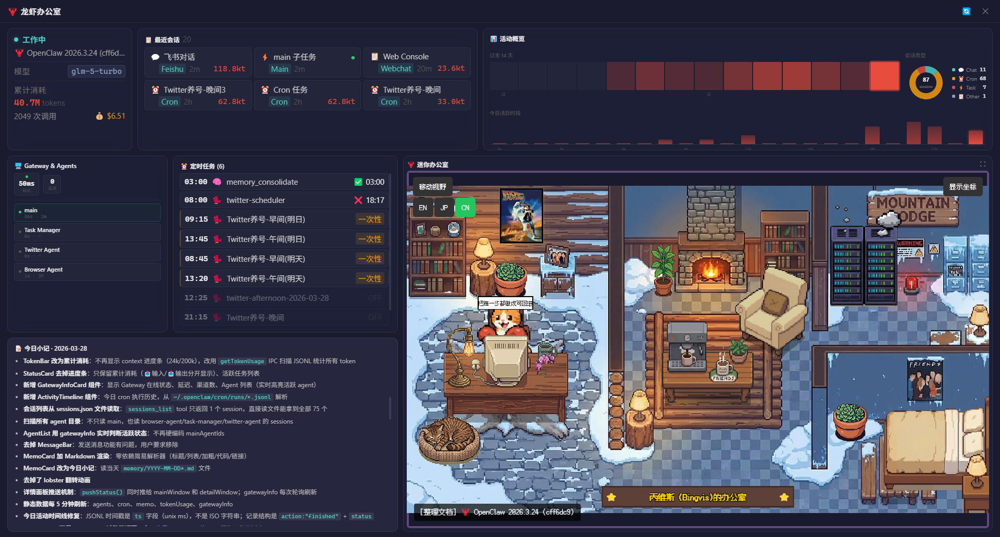

# 🦞 lobster-pet

[中文](#) | [English](#english)

OpenClaw 桌面宠物 + 运营监控看板。灵感来自瑞星小狮子，主角换成小龙虾，实时监控 OpenClaw Agent 运行状态。



## ✨ 功能特性

### 🦞 桌面宠物窗口
- 透明无边框，固定桌面右下角，鼠标穿透
- 6 种状态：待命 / 工作中 / 思考中 / 休眠 / 异常 / 开心
- 每种状态有独立的视觉特效（火焰🔥、灯泡💡、Zzz💤、星星✦、烟雾💨）
- 可拖拽移动、单击查看状态、双击打开详情面板
- 底部 Token 消耗进度条（颜色随用量变化）
- 右键菜单：查看详情 / 退出

### 🏢 龙虾办公室看板
- 80% 屏幕全屏看板，实时展示 OpenClaw 运行状态
- **状态卡片** — Agent 当前状态、模型、累计 Token 消耗
- **最近会话** — 最近 6 个活跃会话（飞书/Cron/子任务/Web）
- **活动概览** — 14 天热力图、会话类型甜甜圈图、24 小时柱状图
- **Gateway & Agents** — 版本、延迟、频道、Agent 列表
- **定时任务** — Cron 任务列表及最近执行状态
- **今日小记** — 自动读取当天 memory 文件
- **迷你办公室** — 像素风办公室场景，角色随 Agent 状态实时移动（支持全屏）
- **刷新动画** — 加载时显示旋转 spinner 遮罩

### 🔄 工作原理

```
OpenClaw Gateway (localhost:18789)
        │
        │  每 30 秒轮询（指数退避，最大 5 分钟）
        ▼
  Electron 主进程 ── fetchStatus()
        │
        ├──► 小龙虾窗口（状态 + 视觉特效）
        ├──► 详情面板（全量数据看板）
        └──► 迷你办公室（postMessage → Phaser iframe）
```

## 🛠️ 技术栈

| 层 | 技术 |
|----|------|
| 桌面框架 | [Electron](https://www.electronjs.org/) (frameless, transparent, alwaysOnTop) |
| 前端框架 | [React](https://react.dev/) 18 + [TypeScript](https://www.typescriptlang.org/) |
| 构建工具 | [Vite](https://vitejs.dev/) (dev) + [esbuild](https://esbuild.github.io/) (electron) |
| 样式方案 | 纯 CSS (CSS 变量体系 + Grid 布局) |
| 迷你办公室 | [Phaser](https://phaser.io/) 3.80.1 (iframe 嵌入) |

## 📊 数据来源

所有数据来自本地 OpenClaw 配置文件，无需额外数据库：

| 数据 | 来源文件 |
|------|---------|
| Agent 状态 / 模型 | Gateway API → `/tools/invoke` |
| 会话列表 | `~/.openclaw/agents/*/sessions/sessions.json` |
| 累计 Token 消耗 | 扫描所有 `*.jsonl` 的 `usage` 字段 |
| Agent 列表 | `~/.openclaw/openclaw.json` → `agents.list` |
| 定时任务 | `~/.openclaw/cron/jobs.json` |
| Cron 执行记录 | `~/.openclaw/cron/runs/*.jsonl` (`action: finished`) |
| 今日小记 | `~/.openclaw/workspace/memory/YYYY-MM-DD*.md` |
| 办公室名字 | `~/.openclaw/workspace/IDENTITY.md` → `Name:` |

## 🚀 快速开始

### 前置条件

- [Node.js](https://nodejs.org/) ≥ 18
- [OpenClaw](https://github.com/openclaw/openclaw) 已安装并运行
- Gateway 默认地址：`localhost:18789`

### 安装

```bash
git clone https://github.com/winston-s-team/lobster-pet.git
cd lobster-pet
npm install
```

### 开发模式

```bash
npm run dev
```

同时启动 Vite dev server 和 Electron 窗口，支持 HMR 热更新。

### 生产构建

```bash
npm run build
```

输出到 `release/` 目录（Windows: NSIS 安装包，macOS: DMG，Linux: AppImage）。

### 配置

| 环境变量 | 说明 | 默认值 |
|---------|------|--------|
| `OPENCLAW_GATEWAY_TOKEN` | Gateway 认证 Token | 自动从 `~/.openclaw/openclaw.json` 读取 |

通常不需要手动配置，Token 会自动从 OpenClaw 配置文件中读取。

## 📁 项目结构

```
lobster-pet/
├── electron/
│   ├── main.ts              # Electron 主进程
│   │                          ├── 窗口管理（宠物窗口 + 详情面板）
│   │                          ├── Gateway 轮询（30s，指数退避最大 5min）
│   │                          └── IPC Handlers（数据查询、状态推送）
│   └── preload.ts           # contextBridge → window.lobsterAPI
├── src/
│   ├── App.tsx              # 小龙虾窗口入口
│   ├── main.tsx             # React 入口（?mode=detail 分流）
│   ├── types/index.ts       # TypeScript 类型定义
│   ├── assets/              # 6 种状态小龙虾图片（透明 PNG）
│   ├── hooks/
│   │   ├── useDraggable.ts  # 窗口拖拽（区分拖拽/点击）
│   │   └── useMouseProximity.ts
│   └── components/
│       ├── LobsterPet.tsx       # 龙虾主体 + 6 种状态特效
│       ├── SpeechBubble.tsx     # 单击气泡（Gateway 状态）
│       ├── StatusBubble.tsx     # 双击气泡（详细信息）
│       ├── TokenBar.tsx         # 底部 Token 进度条
│       ├── DetailPanel.tsx      # 详情面板（全屏看板）
│       ├── StatusCard.tsx       # 状态 + 模型 + 累计消耗
│       ├── TaskGrid.tsx         # 最近 6 个活跃会话
│       ├── ActivityViz.tsx      # 热力图 + 甜甜圈 + 柱状图
│       ├── GatewayAgentsCard.tsx # Gateway 信息 + Agent 列表
│       ├── CronList.tsx         # Cron 任务列表
│       ├── MemoCard.tsx         # 今日小记（Markdown）
│       └── MiniOffice.tsx       # 迷你办公室（iframe + postMessage）
├── public/
│   └── office/              # Star-Office-UI 前端（纯前端模式）
│       ├── index.html       # Phaser 游戏场景（~1400 行）
│       ├── vendor/          # Phaser 3.80.1 引擎
│       ├── fonts/           # ArkPixel 像素字体
│       └── *.webp, *.png    # 像素风素材（背景/家具/角色/装饰）
├── scripts/
│   └── build-electron.mjs   # esbuild 编译 Electron 主进程
├── 截图.png                # README 截图
├── LICENSE                  # MIT 许可证
├── README.md                # 你正在看的文件
└── package.json
```

## 🎨 Star-Office-UI 集成

迷你办公室使用了 [Star-Office-UI](https://github.com/ringhyacinth/Star-Office-UI) 的前端代码和像素风素材。

### 复用内容

- ✅ 像素风办公室背景 (`office_bg_small.webp`, 1280×720)
- ✅ 家具和装饰素材（沙发、办公桌、咖啡机、植物、海报、猫咪、花朵等 15 个）
- ✅ 角色动画 spritesheet（idle、working、sync-animation、error-bug）
- ✅ Phaser 场景逻辑（角色移动、区域切换、气泡对话）
- ✅ 像素字体 [ArkPixel 12px](https://github.com/TakWolf/ark-pixel-font)

### 改造内容

| 改动 | 说明 |
|------|------|
| 去掉 Flask 后端 | 所有 API 调用被 fetch stub 拦截，纯前端运行 |
| postMessage 通信 | 状态从 React 组件通过 postMessage 推入，不轮询 |
| 动态办公室名字 | 从 `IDENTITY.md` 的 `Name:` 字段读取 |
| 状态映射 | OpenClaw 状态 → Star-Office-UI 区域（idle→沙发, working→写字台, thinking→机房, error→bug区） |
| 死代码清理 | 从 4878 行精简到 1411 行（去除底部面板、资产抽屉、Gemini 集成等） |

### ⚠️ 许可证注意

Star-Office-UI 的素材**禁止商用**（仅限学习/演示/交流用途）。本项目遵循相同限制。

如需商用，请替换 `public/office/` 下的素材为自有原创内容。

## 🎭 自定义

### 更换小龙虾图片

替换 `src/assets/` 下的 6 张透明背景 PNG：

| 文件名 | 对应状态 |
|--------|---------|
| `idle-removebg-preview.png` | 待命 |
| `working-removebg-preview.png` | 工作中 |
| `thinking-removebg-preview.png` | 思考中 |
| `sleeping-removebg-preview.png` | 休眠 |
| `error-removebg-preview.png` | 异常 |
| `happy-removebg-preview.png` | 开心 |

推荐尺寸 150×150 或更大，透明背景。

### 自定义办公室名字

在 OpenClaw workspace 的 `IDENTITY.md` 中设置：

```markdown
- **Name:** 你的名字
```

看板会自动读取并显示为「你的名字的办公室」。

## ❓ 常见问题

<details>
<summary><b>小龙虾不显示？</b></summary>

确保 OpenClaw Gateway 正在运行（默认 `localhost:18789`）。可以运行 `openclaw gateway status` 检查。
</details>

<details>
<summary><b>详情面板打不开？</b></summary>

开发模式：确保 `npm run dev` 已启动。生产模式：确保 `npm run build` 构建成功。
</details>

<details>
<summary><b>迷你办公室显示空白？</b></summary>

按 F12 打开 DevTools，检查 Console 是否有 Phaser 加载素材失败的报错。通常是因为网络问题导致 WebP 文件未加载。
</details>

<details>
<summary><b>迷你办公室角色不动？</b></summary>

状态通过 postMessage 从 React 推送，轮询间隔 30 秒。可以通过「刷新」按钮手动触发。
</details>

<details>
<summary><b>办公室名字显示「???的办公室」？</b></summary>

说明 `IDENTITY.md` 的 `Name:` 字段未读取到，检查文件路径和格式。
</details>

<details>
<summary><b>如何打包分发？</b></summary>

运行 `npm run build`，输出在 `release/` 目录。支持 Windows (NSIS)、macOS (DMG)、Linux (AppImage)。
</details>

## 📄 License

MIT（代码部分）。[Star-Office-UI](https://github.com/ringhyacinth/Star-Office-UI) 的像素风素材仅供非商用。

详见 [LICENSE](LICENSE) 文件。

## 🤝 Contributing

欢迎贡献！请遵循以下步骤：

1. Fork 本仓库
2. 创建功能分支 (`git checkout -b feature/amazing-feature`)
3. 提交更改 (`git commit -m 'Add amazing feature'`)
4. 推送分支 (`git push origin feature/amazing-feature`)
5. 发起 Pull Request

## 🙏 Acknowledgments

- [Star-Office-UI](https://github.com/ringhyacinth/Star-Office-UI) — 像素风办公室场景和素材
- [Phaser](https://phaser.io/) — HTML5 游戏引擎
- [OpenClaw](https://github.com/openclaw/openclaw) — AI Agent 框架
- [ArkPixel Font](https://github.com/TakWolf/ark-pixel-font) — 像素字体

---

*桌面宠物这种东西，90年代就有了。但加上 AI Agent 监控，就是另一个故事了。🦞*
